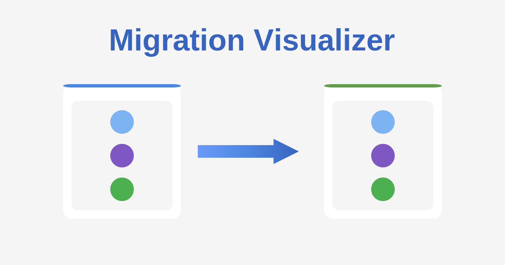
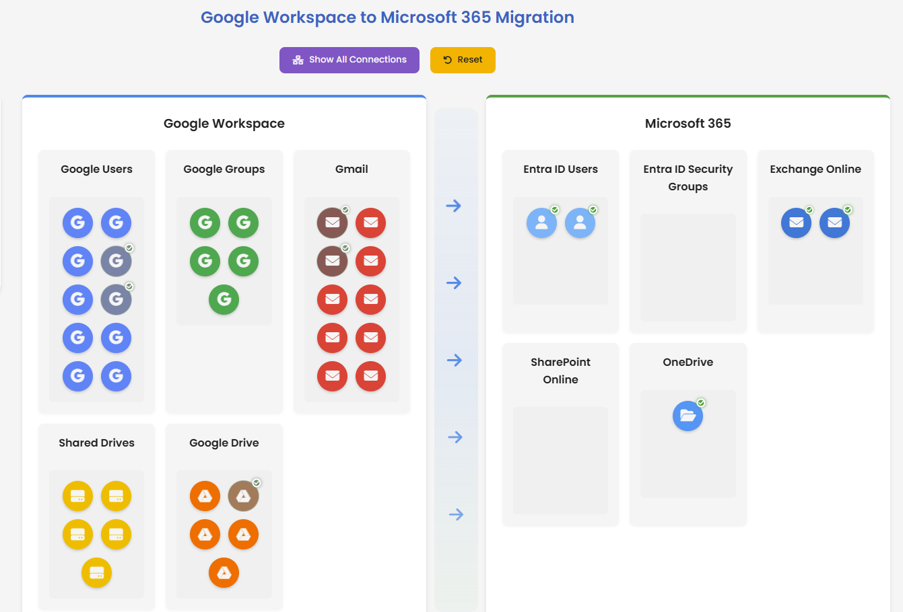

# 

An interactive web application for visualizing Microsoft 365 migration scenarios.

## [🔍 Open Migration Visualizer](https://zerg00s.github.io/migration-visualizer)

---

### Known Limitations

- Static data (no real Microsoft 365 integration)
- No persistent state across sessions
- Limited to predefined object types
- No authentication required

⚠️ This is a visualization tool for educational and planning purposes. It does not perform actual migrations or connect to live Microsoft 365 environments.

---
## 👨‍💻 Author

**By Denis Molodtsov with 💗**